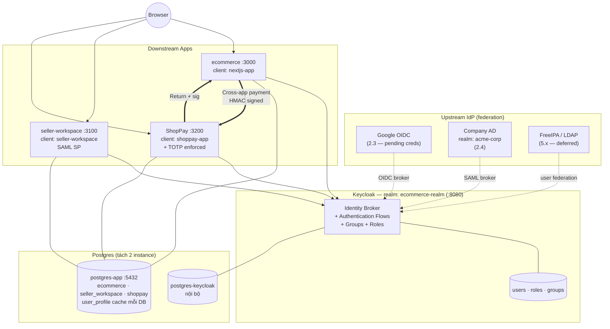
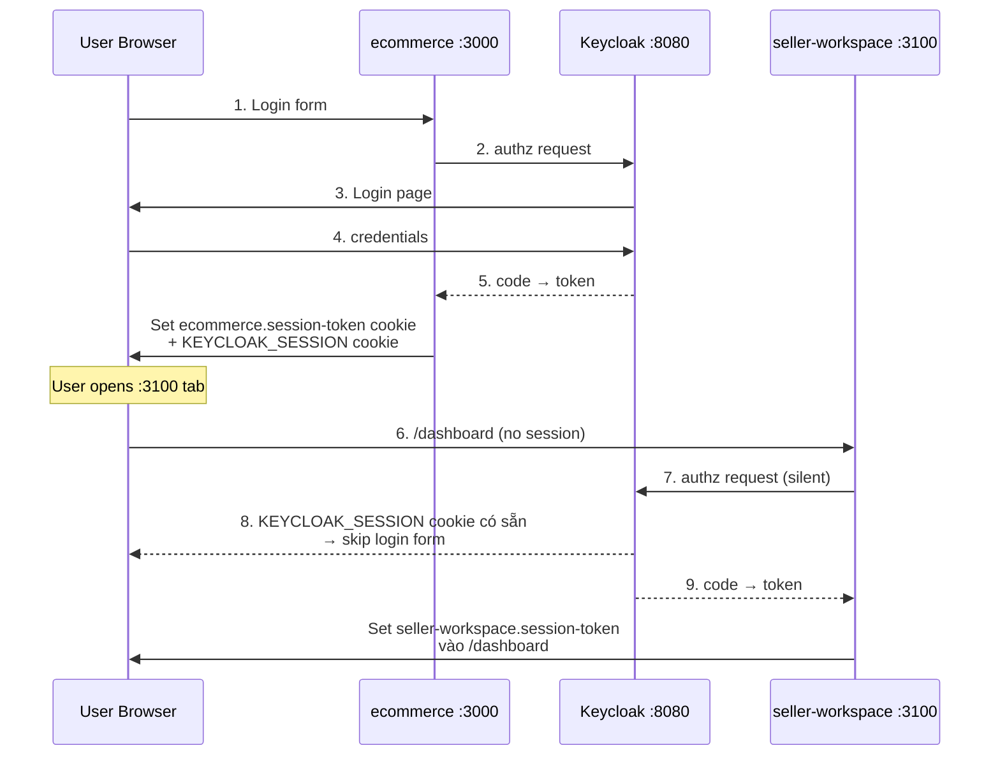
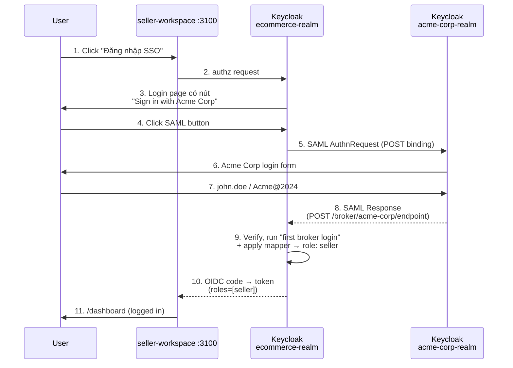
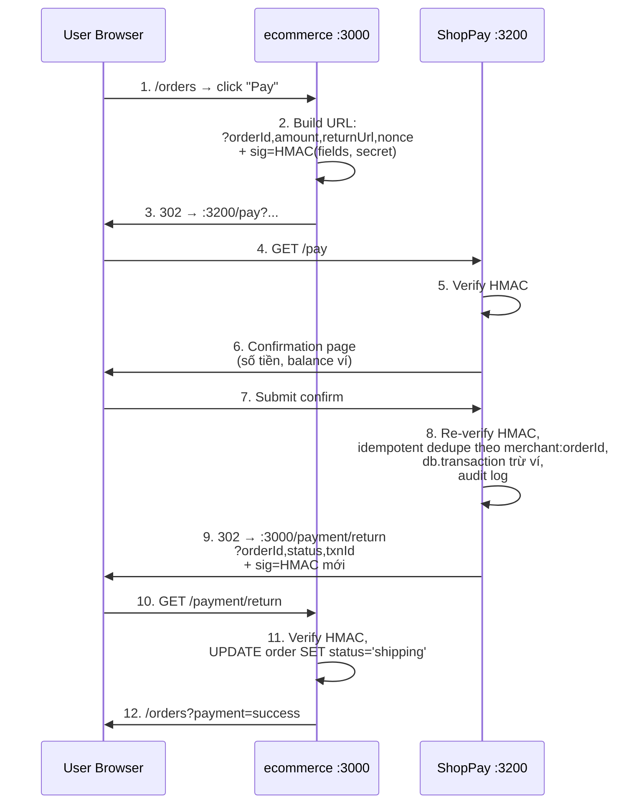
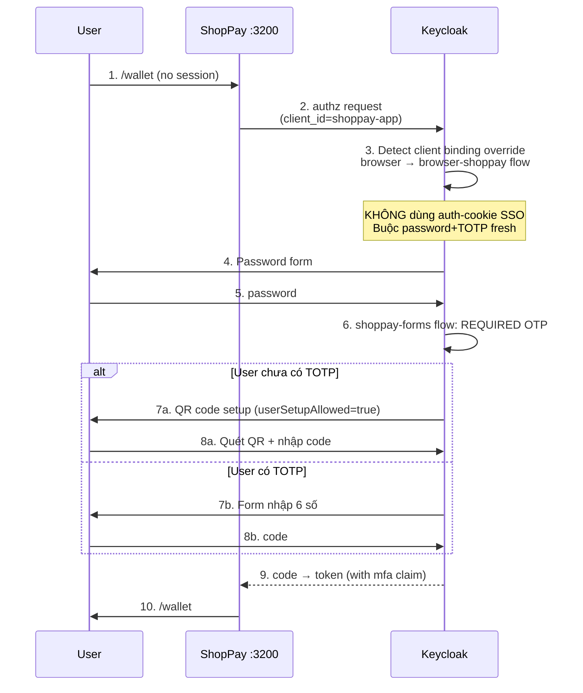

# Ecommerce Platform — Multi-App SSO Demo

Hệ sinh thái 3 app dùng chung 1 Keycloak làm IdP — mô phỏng kiến trúc Shopee / ShopeeFood / ShopeePay.

| App | Port | Vai trò |
|---|---|---|
| [web-app/](web-app) | 3000 | **ecommerce** — chợ cho buyer/seller |
| [seller-workspace/](seller-workspace) | 3100 | **back-office** — chủ shop + nhân viên (kho/CSKH/kế toán) |
| [shoppay/](shoppay) | 3200 | **ví điện tử** — wallet + KYC, **bắt buộc MFA (TOTP)** |

Cả 3 app login chung qua realm `ecommerce-realm`. 1 lần đăng nhập → vào được mọi app (silent SSO).

---

## Kiến trúc



| Stack | Version |
|---|---|
| Next.js | 16 (App Router, Turbopack) |
| NextAuth | 4.24 |
| Keycloak | latest |
| Drizzle ORM | 0.45 |
| PostgreSQL | 15 |
| Node.js | **22 LTS** |

---

## Sequence diagrams

### OIDC silent SSO cross-app (Kịch bản B)



### SAML brokering (Kịch bản G1)



### Cross-app payment với HMAC (Kịch bản F2/F3)



### TOTP enforce per-client (Kịch bản E)



---

## Setup từ 0

Yêu cầu: Docker + Node.js 22 LTS. WSL/Linux/Mac đều OK.

```bash
git clone <repo> && cd ecommerce-platform

bash scripts/bootstrap.sh    # sinh secret, tạo root .env + 3 app .env (idempotent)
bash scripts/reset.sh        # up infra Docker + push DB schema cho 3 app
npm install && npm run dev   # cài concurrently + chạy cả 3 app
```

Xong. 3 app sống ở :3000 / :3100 / :3200, Keycloak :8080. `Ctrl+C` 1 lần kill cả 3.

> Mọi lệnh đời sống (`dev`, `db:push`) chạy ở **root**. KHÔNG `cd` vào `web-app/`, `seller-workspace/`, `shoppay/`.

> Lần đầu mỗi route compile ~20–30s (Turbopack). Đã có warmup script chạy ngầm pre-compile các route chính, log thấy `[warm] ✓ done` là routes ấm rồi.

---

## Tài khoản

### Keycloak Admin Console — http://localhost:8080

Username/password đọc từ root `.env`:

```bash
grep -E '^KEYCLOAK_ADMIN' .env
```

(Mặc định cũ `admin/admin` đã bỏ — secret giờ là 32-byte random.)

### User demo trong realm `ecommerce-realm`

Password policy: `length(8) and digits(1) and upperCase(1) and lowerCase(1) and specialChars(1)`.

| Username | Password | Role | Dùng cho |
|---|---|---|---|
| `buyer1` | `Buyer1@2024` | buyer | Mua hàng ở ecommerce |
| `seller1` | `Seller1@2024` | seller | Bán hàng + vào seller-workspace |
| `admin1` | `Admin1@2024` | admin | Duyệt seller request |
| `warehouse1` | `Warehouse1@2024` | staff-warehouse | Nhân viên kho (group `/store-demo-1/warehouse`) |
| `cs1` | `Cs1@2024` | staff-cs | Nhân viên CSKH |
| `finance1` | `Finance1@2024` | staff-finance | Nhân viên tài chính |
| `wallet1` | `Wallet1@2024` | wallet-user | **Bắt buộc setup TOTP** ở login đầu |

---

## Test plan đầy đủ

> **Quy ước**: mỗi kịch bản bắt đầu từ **incognito sạch** (hoặc clear cookie + close tab). SSO nhớ session — nếu không reset, dễ "tưởng là OK" do phiên cũ.

> **Tiền điều kiện** (chạy 1 lần): `bash scripts/bootstrap.sh && bash scripts/reset.sh && npm run dev`. Đợi log thấy `[warm] ✓ done`.

| # | Kịch bản | Feature kiểm chứng | Bắt buộc |
|---|---|---|---|
| A | Smoke test | 3 app + Keycloak alive, secret khớp | ✅ |
| B | Silent SSO cross-app | OIDC SSO 3 app cùng realm | ✅ |
| C | Keycloak Groups → role nhân viên | Group + sub-group + role mapping | ✅ |
| D | Server actions + audit log seller-workspace | AuthZ 2-layer + audit trail | ✅ |
| E | TOTP enforce per-client cho ShopPay | `authenticationFlowBindingOverrides` | ✅ |
| F1 | KYC admin approve full e2e | Keycloak Admin API + role grant runtime | ✅ |
| F2 | Topup gating bằng `kyc-verified` | Business rule + role check | |
| F3 | Cross-app payment HMAC | ecommerce → ShopPay → return signed | ✅ |
| G1 | Google IdP federation | OIDC brokering + IdP Mapper auto-role | 🟡 cần Google OAuth credential |
| G2 | SAML brokering Acme Corp | SAML 2.0 SP-IdP cross-realm | ✅ |
| G3 | FreeIPA + LDAP federation | LDAP user federation + Kerberos | 🟡 heavy infra |
| H | Refresh token rotation | NextAuth tự refresh access token | |
| I | Frontchannel logout (SLO) | 1 logout → 3 app cùng signout | |
| J | Admin role management UI | Quản lý role qua Keycloak Admin API từ web | |
| K | Realm denied page (no info leak) | Buyer vào :3100 không thấy nav menu | |
| L | Refresh after wipe | Idempotency của bootstrap + reset scripts | |

---

### A. Smoke test (5 phút)

**Mục tiêu**: confirm 3 app + Keycloak alive, secret matched.

```bash
curl -s http://localhost:8080/realms/ecommerce-realm/.well-known/openid-configuration | head -c 80
curl -sI http://localhost:3000 http://localhost:3100 http://localhost:3200
```

→ Phải thấy `"issuer":"http://localhost:8080/realms/ecommerce-realm"` + 3 lệnh curl trả `200` hoặc `307`.

Mở incognito → http://localhost:3000 → "Đăng nhập" → `buyer1` / `Buyer1@2024` → quay về với header chào tên user.

❌ **Lỗi `invalid_client`** → `KEYCLOAK_CLIENT_SECRET` trong `web-app/.env` không khớp `NEXTJS_APP_CLIENT_SECRET` trong root `.env`. Chạy `bash scripts/bootstrap.sh` lại (idempotent, tự sync).

---

### B. Silent SSO cross-app

**Mục tiêu**: 1 lần login dùng cho cả 3 app trên cùng realm.

1. Login `seller1` / `Seller1@2024` ở :3000.
2. **Cùng tab incognito**, mở tab mới → :3100 → click "Đăng nhập SSO".
3. ✅ Redirect Keycloak rồi **quay về thẳng `/dashboard`**, KHÔNG hỏi password.
4. Mở thêm tab :3200 → "Đăng nhập SSO" → bị **bắt nhập password + TOTP** (vì shoppay-app override flow, xem E).

**Verify** trong DevTools → Network: request `auth/realms/.../protocol/openid-connect/auth?...` trả `302` thẳng về `/api/auth/callback/keycloak` (KEYCLOAK_SESSION cookie có sẵn → skip login form).

---

### C. Keycloak Groups → quyền nhân viên

**Mục tiêu**: cùng 1 store, 3 nhân viên 3 quyền khác nhau qua sub-group.

1. Incognito → :3100 → login `warehouse1` / `Warehouse1@2024` → `/dashboard`.
   ✅ Page hiển thị `roles: ["staff-warehouse"]`, `groups: ["/store-demo-1/warehouse"]`.
2. Logout → login `cs1` → `groups: ["/store-demo-1/cs"]`, `roles: ["staff-cs"]`.
3. Logout → login `finance1` → `groups: ["/store-demo-1/finance"]`, `roles: ["staff-finance"]`.

→ Cùng parent group `store-demo-1`, sub-group quyết định role, nên 1 store quản 3 nhân viên với 3 vai trò mà không phải tạo realm-role mới cho mỗi store.

---

### D. Server actions + audit log (seller-workspace)

**Mục tiêu**: AuthZ 2-layer (route guard + action guard) + audit trail.

1. Login `seller1` ở :3100 → `/staff` → nhập 1 email bất kỳ + chọn role staff → submit.
2. ✅ Form trả "đã mời", entry mới hiện trong list.
3. Vào `/audit` → ✅ thấy entry `action: "staff.invite"`, `actorId: <sub seller1>`, metadata có email + role.
4. Logout → login `warehouse1` (role staff-warehouse, không phải seller) → :3100 vẫn vào dashboard được, NHƯNG `/staff` action bị reject ở server (`Forbidden: cần role seller hoặc admin`).

→ Demo `proxy.ts` chặn route, action server tự check 1 lần nữa (defense in depth).

---

### E. TOTP enforce per-client cho ShopPay

**Mục tiêu**: cùng user pool, 1 client (`shoppay-app`) bắt buộc MFA mỗi lần.

1. Incognito → :3200 → "Đăng nhập SSO" → form Keycloak hỏi password (KHÔNG silent SSO vì flow `browser-shoppay` không có `auth-cookie`).
2. Login `seller1` / `Seller1@2024` (chưa có TOTP).
3. ✅ Keycloak hiện QR code → cài Google Authenticator / Authy / 1Password → quét → nhập 6 chữ số → vào /wallet.
4. Logout :3200 → login lại `seller1` → ✅ luôn bị hỏi password + 6 chữ số code mới.
5. **Cùng** `seller1` vào :3000 → ✅ login bằng password thường, **không** bị TOTP.

→ Demo `authenticationFlowBindingOverrides.browser` áp dụng riêng `shoppay-app`, không leak sang client khác.

---

### F1. KYC admin approve full e2e (chuỗi quan trọng nhất)

**Mục tiêu**: action guard + Keycloak Admin API call + audit + token refresh effect.

1. Incognito 1: login `wallet1` / `Wallet1@2024` ở :3200 (qua TOTP) → `/kyc` → submit form (Họ tên, CCCD, số bất kỳ) → ✅ status `pending`.
2. ✅ Trong `/kyc` thấy alert "Sau khi nộp, reviewer (admin / staff-finance) sẽ duyệt".
3. Incognito 2: login `admin1` / `Admin1@2024` ở :3200 → ✅ TopBar có thêm 2 link **KYC Review** + **Audit log**.
4. Vào `/kyc/admin` → ✅ thấy card hồ sơ pending của `wallet1` → click **Approve**.
5. Verify Keycloak Admin Console → Users → `wallet1` → Role mapping → ✅ **`kyc-verified`** đã được gán.
6. Vào `/audit` → ✅ entry `kyc.approve` với metadata `{targetUserId, assignedRole: "kyc-verified", docType}`.
7. Quay về incognito 1 (wallet1): logout/login lại :3200 → ✅ JWT mới có role `kyc-verified` → `/topup` 6tr → OK.

**Tại sao cần logout/login**: NextAuth cache role trong session cookie. Để pickup role mới ngay không logout, cần Refresh token rotation (kịch bản H) — nhưng role refresh từ `/protocol/openid-connect/userinfo` chứ không từ refresh_token, NextAuth không tự làm. Rõ ràng nhất là logout/login.

---

### F2. Topup gating bằng `kyc-verified`

**Mục tiêu**: business rule check role thật sự ngăn topup lớn nếu chưa KYC.

1. `wallet1` chưa có `kyc-verified` (rollback role qua Admin Console nếu đã có).
2. :3200 → `/topup` → 1.000.000 → ✅ OK.
3. Topup 6.000.000 → ❌ throw `Giao dịch trên 5,000,000 VND yêu cầu KYC`.
4. Sau F1 (đã có `kyc-verified` + relogin) → topup 6.000.000 → ✅ OK.

---

### F3. Cross-app payment HMAC (ecommerce → ShopPay → return)

**Mục tiêu**: 2 service riêng biệt giao tiếp qua signed redirect, không trust query string trực tiếp.

1. Login `buyer1` ở :3000 → /cart → mua 1 product → /orders → ✅ order status `pending`.
2. Click nút "⚡ Pay với ShopPay" → ✅ chuyển sang :3200/pay với URL có `?merchant&orderId&amount&returnUrl&nonce&sig=...`.
3. ShopPay verify HMAC → ✅ hiện confirmation page với balance ví.
4. Click "Xác nhận thanh toán" → server re-verify sig + idempotent dedupe theo `merchant:orderId` + trừ ví → audit log `wallet.pay`.
5. Redirect về :3000/payment/return với `?orderId&status=success&txnId&sig=...`.
6. ecommerce verify return sig → UPDATE order status='shipping'.
7. ✅ /orders thấy order trạng thái "Đang giao hàng".

**Test tampering**: thử sửa `amount` trong URL trước khi confirm → ShopPay reject "HMAC không khớp".

**Test idempotency**: F5 reload trang confirm → ví không bị trừ 2 lần (dedupe theo external_ref).

---

### G1. Google IdP federation 🟡

**Tiền điều kiện**: đăng ký Google OAuth client.

1. https://console.cloud.google.com/apis/credentials → Create OAuth 2.0 Client ID, type "Web application".
2. Authorized redirect URIs: `http://localhost:8080/realms/ecommerce-realm/broker/google/endpoint` (đúng từng ký tự).
3. Copy Client ID + Client Secret → paste vào `GOOGLE_IDP_CLIENT_ID` + `GOOGLE_IDP_CLIENT_SECRET` trong root `.env`.
4. `bash scripts/reset.sh`.

**Test**:
1. Incognito → :3000 → "Đăng nhập" → form Keycloak ✅ có thêm nút **"Google"** dưới password.
2. Click → consent Google → quay về :3000.
3. Verify Keycloak Admin → Users → tìm user mới (email Google) → ✅ role `buyer` được auto-assigned (qua IdP Mapper `google-to-buyer`), email mark là verified (do `trustEmail=true`).

---

### G2. SAML brokering Acme Corp (fully automated)

**Mục tiêu**: nhân viên login bằng SAML từ "công ty seller" giả lập, không tạo account riêng trên realm chính.

`acme-corp-realm` có sẵn 2 user: `john.doe` / `jane.smith`, password `Acme@2024`.

1. Incognito → :3100 → "Đăng nhập SSO" → form Keycloak ✅ có nút **"Sign in with Acme Corp (SAML)"**.
2. Click → redirect tới `acme-corp-realm` login page → nhập `john.doe` / `Acme@2024`.
3. Acme Corp tạo SAML assertion → POST về `/realms/ecommerce-realm/broker/acme-corp/endpoint`.
4. Keycloak verify, run "first broker login" flow, apply mappers:
   - `acme-corp-to-seller` → role `seller`
   - `acme-corp-firstName` / `lastName` / `email` → user attributes
5. ✅ Quay về :3100, vào `/dashboard` ngay với role seller.
6. Verify Keycloak Admin → realm `ecommerce-realm` → Users → `john.doe@acme.com` → tab **Identity provider links** ✅ link với `acme-corp`.

---

### G3. FreeIPA domain controller + LDAP federation 🟡

**Heavy infra** — không tự start với `compose up` thường, chạy có chủ ý.

```bash
docker compose --profile domain up -d freeipa
docker compose logs -f freeipa | grep -m1 "FreeIPA server configured"   # ~5-10 phút
bash scripts/freeipa-seed.sh                                            # tạo employee1/employee2
```

**Wire LDAP federation manual** (config qua realm.json không reliable):

1. http://localhost:8080 → realm `ecommerce-realm` → User Federation → **Add LDAP provider**.
2. Vendor: **Red Hat Directory Server** (FreeIPA = 389-ds).
3. Connection URL: `ldap://freeipa:389` · Bind DN: `uid=admin,cn=users,cn=accounts,dc=example,dc=test` · Bind credential: `Admin@2024`.
4. Edit mode: `READ_ONLY` · Users DN: `cn=users,cn=accounts,dc=example,dc=test` · Username LDAP attribute: `uid`.
5. **Test connection** + **Test authentication** → đều OK → Save.
6. Tab **Mappers** → ensure `email`, `first name`, `last name` map đúng.
7. **Synchronize all users** → ✅ 2 user FreeIPA hiện trong realm.

**Test**: :3100 → "Đăng nhập SSO" → `employee1` / `Emp@2024` → ✅ vào dashboard. Cùng password đó dùng được:
- `docker compose exec freeipa-1 kinit employee1` → ✅ nhận Kerberos ticket.
- SSH vào VM Linux đã join domain (out-of-scope demo này, nhưng workflow giống nhau).

---

### H. Refresh token rotation

**Mục tiêu**: NextAuth tự refresh khi access token gần hết hạn, không bị logout giữa session.

Keycloak default access token TTL = 5 phút. Test:

1. Login `buyer1` :3000.
2. Đợi >5 phút (đi pha cà phê).
3. Reload page hoặc navigate → ✅ vẫn login.
4. Verify trong terminal log: thấy line `[refreshAccessToken]` hoặc 1 request silent đến `/protocol/openid-connect/token` với `grant_type=refresh_token`.

**Negative test**: revoke session ở Keycloak Admin (Users → buyer1 → Sessions → Logout all sessions) → reload :3000 → access token refresh fail → NextAuth set `token.error = "RefreshAccessTokenError"` → app force re-login.

---

### I. Frontchannel logout (Single Logout)

**Mục tiêu**: logout 1 app → 2 app khác đồng loạt signout qua Keycloak iframe.

1. Login đủ 3 app trong cùng tab incognito.
2. Click "Đăng xuất" ở :3000.
3. ✅ Keycloak hiện trang trắng nhanh (load 3 iframe ẩn → mỗi iframe gọi `/api/auth/frontchannel-logout` của 1 client).
4. Quay lại tab :3100 và :3200, reload → ✅ cả 2 đã signout (cookie bị clear).

> Lưu ý: nếu browser block 3rd-party cookie cứng, frontchannel iframe không clear được. Đây là tradeoff bảo mật (chống tracking) vs SLO UX. Bypass: dùng same-site domain cho cả 3 app.

---

### J. Admin role management UI

**Mục tiêu**: admin có thể grant/revoke role qua web UI (không phải Keycloak Admin Console).

1. Login `admin1` ở :3000 → :3000/admin/users.
2. ✅ List user từ Keycloak (qua Admin API qua `backend-admin-client`).
3. Click chip role (vd `staff-warehouse`) → ✅ POST `/api/admin/users/role` với `action=revoke` → role biến mất.
4. Dropdown "+ thêm" → chọn `kyc-verified` → ✅ chip mới hiện ra.
5. Cross-check: Keycloak Admin Console → user đó → Role mapping → đồng bộ với UI.

**Negative test**: login `buyer1` → :3000/admin/users → ✅ "Không đủ quyền".

---

### K. Realm denied page (no info leak)

**Mục tiêu**: user không quyền vào :3100 thấy page tối giản, không leak path.

1. Login `buyer1` ở :3100 (hoặc Google user mới có role `buyer`).
2. ✅ Redirect về `/denied` thay vì `/dashboard` hoặc `/`.
3. ✅ Page chỉ hiện "🚫 Không đủ quyền hạn" + 2 nút "Về trang chủ" / "Đăng nhập tài khoản khác".
4. ✅ TopBar **KHÔNG** show nav links Dashboard / Nhân viên / Audit log.
5. Thử URL trực tiếp `/dashboard`, `/staff` → đều redirect `/denied`.

---

### L. Idempotent reset

**Mục tiêu**: chạy bootstrap + reset nhiều lần không phá data hoặc tạo duplicate.

```bash
bash scripts/bootstrap.sh   # lần 1: tạo .env
bash scripts/bootstrap.sh   # lần 2: skip vì .env đã có
bash scripts/reset.sh       # wipe + reimport + push schema + seed data
bash scripts/reset.sh       # backup → wipe → reimport → schema vẫn ok
```

✅ Chạy lần 2 không lỗi, không tạo `.env` đè secret cũ, sample data không double-insert.

---

## Reset nhanh

Khi sửa `keycloak/ecommerce-realm.json`, đổi user/role/client → cần wipe + import lại:

```bash
bash scripts/reset.sh
```

Script tự backup `pg_dumpall` ra `backup-YYYYMMDD-HHMM.sql` trước khi wipe.

---

## Cấu trúc

```
ecommerce-platform/
├── .env / .env.example         # Secret root (Postgres + Keycloak admin + client secrets)
├── package.json                # Root: concurrently runner cho 3 app
├── docker-compose.yml          # Postgres + Keycloak + Nginx
├── scripts/reset.sh            # Wipe + reimport realm + tạo DB + push schema
│
├── keycloak/
│   ├── ecommerce-realm.json    # Realm + clients + roles + groups + users (secret = ${VAR})
│   └── entrypoint.sh           # Resolve ${VAR} từ env vào realm.json trước khi Keycloak start
├── nginx/nginx.conf
│
├── web-app/                    # ecommerce (3000)
│   ├── app/                    # buyer/seller/admin pages + API
│   ├── db/schema.ts            # stores, products, orders, cart, seller_upgrade_requests
│   ├── lib/keycloak-admin.ts   # Keycloak Admin API client
│   └── proxy.ts                # NextAuth middleware
│
├── seller-workspace/           # back-office (3100)
│   ├── app/dashboard, /staff, /audit
│   ├── db/schema.ts            # staff_invitations, store_permissions, audit_logs
│   └── lib/audit.ts
│
└── shoppay/                    # ví (3200)
    ├── app/wallet, /topup, /kyc
    ├── db/schema.ts            # wallets, transactions, kyc_documents
    └── lib/wallet.ts           # topUp / pay (transactional)
```

---

## Troubleshooting

**`invalid_client` khi login** → Secret trong app `.env` không khớp giá trị Keycloak đang giữ. Verify:
```bash
grep CLIENT_SECRET .env web-app/.env seller-workspace/.env shoppay/.env
```

**`/dashboard` redirect lặp về signin** → Cookie name custom phải khớp giữa `app/api/auth/[...nextauth]/route.ts` và `proxy.ts` của app đó.

**`relation "products" does not exist`** → Chưa push schema. `bash scripts/reset.sh` hoặc `npm run db:push`.

**`CLIENT_FETCH_ERROR / NetworkError when attempting to fetch resource`** → next-auth client timeout chờ `/api/auth/session` lúc Turbopack compile lần đầu (xem log thấy session 200 sau 13–20s). Refresh trang khi đã `Ready` là hết. Nếu kéo dài, kiểm tra `NEXTAUTH_URL` trong app `.env` có đúng port không.

**Buyer login :3100 bị redirect `/?denied=role`** → Đúng intent. `seller-workspace/proxy.ts` chỉ cho `seller / admin / staff-*` vào `/dashboard`, `/staff`, `/audit`. Để test :3100, dùng `seller1` hoặc `warehouse1` / `cs1` / `finance1`.

**`permission denied … docker.sock`** → User WSL chưa thuộc group docker:
```bash
sudo usermod -aG docker $USER && exit   # mở lại WSL tab
```

**`CREATE DATABASE cannot run inside a transaction block`** → Mỗi DB tách 1 cờ `-c` riêng trong `psql`.

**Next dev exit silently sau "Ready"** → Đang dùng Node 25/odd. Đổi Node 22 LTS:
```bash
nvm install 22 && nvm use 22 && rm -rf node_modules && npm install
```

**`WSL 1 is not supported`** khi chạy node trong WSL → đang gọi Windows node.exe. Cài node trong WSL hoặc chạy từ PowerShell.

**`Can't resolve 'tailwindcss'`** → 3 `next.config.ts` phải có `turbopack: { root: import.meta.dirname }` để pin root vào app dir, không dùng monorepo root.

**`npm audit fix --force` đã chạy lỡ tay** → Lệnh đó downgrade `next-auth` về v3, vỡ tất cả import. Restore:
```json
"next-auth": "^4.24.13",
"drizzle-kit": "^0.31.10"
```
Rồi `rm -rf node_modules package-lock.json && npm install`.

---

## Hướng đi tiếp theo của đồ án

Hiện tại đã hoàn thành toàn bộ feature IAM core. Phần dưới là 3 hướng mở rộng có giá trị thực, theo thứ tự độ khó tăng dần.

### 1. Production hardening (1-2 tuần)

Demo chạy ngon trên `localhost`. Để deploy thật, cần:

- **HTTPS + reverse proxy**: hiện cookie set `secure: false` cho dev. Switch về `secure: true` + dùng nginx/traefik với cert Let's Encrypt. Tất cả URL `http://localhost:8080` → đổi thành `https://kc.example.com`.
- **Postgres backup tự động**: cron `pg_dump` daily, ship S3 / B2.
- **Vault / Doppler / AWS Secrets Manager** thay `.env` files. Pattern hiện tại (env file) ổn cho dev, nhưng prod nên có rotation tự động.
- **Rate limiting + WAF**: nginx có sẵn `nginx.conf` với `limit_req`, mở rộng cho login endpoint chống brute force.
- **Observability**: Keycloak metrics → Prometheus, log → Loki/ELK. Track failed login attempts, token refresh failures, slow queries.
- **Migration framework**: hiện dùng `drizzle-kit push` (auto-detect schema diff). Production nên dùng migration files versioned qua `drizzle-kit generate`, apply qua CI/CD.
- **Test coverage**: viết unit + integration test cho server actions, HMAC verify, auth flow. Hiện chưa có test nào.

### 2. Tính năng IAM nâng cao (2-3 tuần)

- **Authorization Services / Fine-grained permissions** — Keycloak có Resource Server / Scope-based permission. Demo: chuyển từ RBAC tự code (proxy.ts check role) sang policy declarative trong Keycloak (`User has role X AND resource matches Y AND time is between 9-17h`). App chỉ cần gọi `/protocol/openid-connect/token/introspect` với scope.
- **Step-up authentication chuẩn `acr_values`** — thay vì enforce TOTP mỗi login ShopPay (xấu UX), chỉ prompt TOTP khi user thực hiện sensitive op (topup > N triệu, đổi password, transfer ví). Đòi hỏi:
  - Custom Authentication Flow trả `acr=2` khi qua TOTP.
  - App request authorize với `acr_values=2` lúc cần.
  - NextAuth track `session.acr` từ id_token claim.
- **WebAuthn / Passkey** — thay TOTP bằng FIDO2 passkey. Keycloak Admin → Authentication → Policies → WebAuthn. Demo passwordless login.
- **Account linking auto-by-email** — Google user có cùng email với form-registered user → link silent thay vì hỏi confirm. Edit "First Broker Login" flow, set "Confirm Link Existing Account" → DISABLED.
- **OIDC Logout standard chuẩn (Backchannel)** — frontchannel iframe có giới hạn (3rd-party cookie blocking). Backchannel logout dùng server-to-server: Keycloak POST `logout_token` (signed JWT) tới mỗi client `backchannel.logout.url`. App parse, verify, store revoked sid trong DB → check trong session callback.
- **Event Listener SPI (Java)** — sync mọi user CRUD event từ Keycloak → app DB không phụ thuộc login. Build Java module, extend Keycloak image, deploy `.jar` vào `/opt/keycloak/providers/`.

### 3. Mở rộng platform (1-2 tháng)

- **App thứ 4: ShopFood** — restaurant marketplace, demo multi-tenant. Roles mới: `restaurant-owner`, `rider`. Realm thêm `shopfood-app` client. Test SSO 4 app cùng lúc.
- **Mobile app via OIDC** — React Native / Flutter dùng `appauth` lib + PKCE (public client, không secret). Demo cùng user pool cho web + mobile.
- **B2B SAML cho Seller Workspace thật** — thay realm `acme-corp-realm` mock bằng tích hợp Azure AD / Okta thật. Audience-restricted SAML, signed assertion với cert thật.
- **FreeIPA / AD multi-domain federation** — 1 Keycloak làm hub federation cho 3-4 LDAP của các "công ty" khác nhau, mỗi user thấy chỉ tài nguyên của domain mình.
- **Audit data warehouse** — tất cả audit log từ 3 app + Keycloak events → ClickHouse / BigQuery → dashboard Grafana cho compliance officer.
- **Đa ngôn ngữ + i18n** — Keycloak login pages, app strings dùng i18n. Hỗ trợ EN + JP + KO ngoài VI.

### 4. Báo cáo / luận văn

- **Slide kiến trúc** — extract từ Mermaid diagrams hiện có, format poster A0.
- **Performance benchmark** — k6 / wrk load test login flow, đo throughput thực tế (req/s, P99 latency).
- **So sánh** — bảng feature matrix Keycloak vs Auth0 vs Okta vs AWS Cognito. Trade-off self-host vs SaaS.
- **Threat model STRIDE** — phân tích Spoofing/Tampering/Repudiation/Information disclosure/DoS/Elevation cho mỗi component, mitigations đã làm.

---

Xem [todo.md](todo.md) cho status chi tiết từng item, [PLAN.md](PLAN.md) cho phân tích kiến trúc các quyết định lớn.
