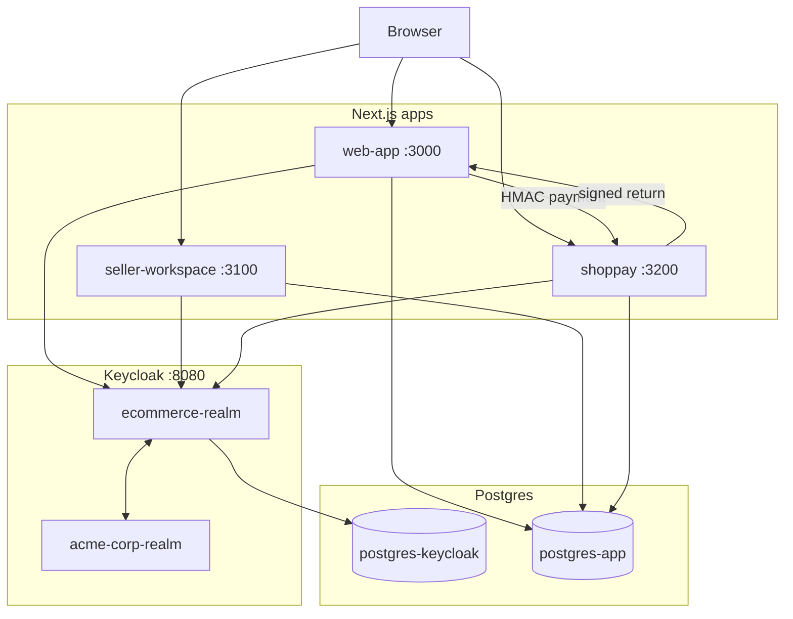

# Ecommerce Platform - Multi-App SSO Demo

Repo mô phỏng hệ sinh thái ecommerce gồm marketplace, seller back-office và ví điện tử, dùng chung Keycloak làm Identity Provider.

| App | Port | Vai trò |
| --- | --- | --- |
| `web-app` | 3000 | Ecommerce marketplace cho buyer/seller/admin |
| `seller-workspace` | 3100 | Portal quản lý shop và nhân viên |
| `shoppay` | 3200 | Ví điện tử, KYC, topup, payment, MFA |
| Keycloak | 8080 | OIDC IdP, SAML broker, role/group/MFA/SLO |
| Nginx | 8000 | Reverse proxy local |

## Điểm nổi bật

- Single Sign-On cho 3 app qua OIDC.
- Single Logout qua Keycloak frontchannel logout + client-side watcher.
- ShopPay có TOTP flow riêng cho client `shoppay-app`.
- SAML identity brokering với mock company realm `acme-corp-realm`.
- Cross-app payment ecommerce -> ShopPay -> ecommerce bằng HMAC-SHA256.
- KYC admin approve gán role `kyc-verified` bằng Keycloak Admin API.
- Topup > 5.000.000 VND yêu cầu role `kyc-verified` trong token hiện tại; sau khi admin duyệt KYC, user cần logout/login lại để nhận token mới.
- Secret tách ra `.env`, realm JSON dùng placeholder runtime.

## Kiến trúc



## Yêu cầu

- Docker Desktop (bật sẵn).
- Node.js **22 LTS** (`node -v` phải hiện `v22.x`).
- Một trong hai:
  - **Windows**: PowerShell 5+ (có sẵn) hoặc pwsh 7.
  - **Mac / Linux / WSL**: Bash.

## Setup nhanh

### Windows (PowerShell)

```powershell
git clone <repo>
cd ecommerce-platform
powershell scripts/setup.ps1
npm run dev
```

### Mac / Linux / WSL (Bash)

```bash
git clone <repo>
cd ecommerce-platform
bash scripts/bootstrap.sh   # sinh .env
bash scripts/reset.sh       # docker up + push DB schema
npm install                  # root + 3 app (tự chạy postinstall)
npm run dev
```

> **Lưu ý**: `npm install` ở root sẽ tự install cả 3 sub-app (web-app, seller-workspace, shoppay) nhờ `postinstall` script.

Sau khi chạy:

- Ecommerce: http://localhost:3000
- Seller Workspace: http://localhost:3100
- ShopPay: http://localhost:3200
- Keycloak: http://localhost:8080

Lưu ý:

- Lần đầu Turbopack compile route có thể chậm. Đợi log `[warm] done` hoặc route tự load xong.
- Khi sửa realm JSON, chạy lại `bash scripts/reset.sh` để reimport.
- Không commit root `.env`.

## Tài khoản demo

Admin Keycloak đọc từ root `.env`:

```bash
grep -E '^KEYCLOAK_ADMIN' .env
```

User demo trong `ecommerce-realm`:

| Username | Password | Role chính | Dùng cho |
| --- | --- | --- | --- |
| `buyer1` | `Buyer1@2024` | `buyer` | Mua hàng |
| `seller1` | `Seller1@2024` | `seller` | Seller workspace |
| `admin1` | `Admin1@2024` | `admin` | Admin/KYC review |
| `warehouse1` | `Warehouse1@2024` | `staff-warehouse` | Nhân viên kho |
| `cs1` | `Cs1@2024` | `staff-cs` | CSKH |
| `finance1` | `Finance1@2024` | `staff-finance` | Finance/KYC review |
| `wallet1` | `Wallet1@2024` | `wallet-user` | ShopPay và KYC |

User demo trong `acme-corp-realm`:

| Username | Password | Kết quả khi broker |
| --- | --- | --- |
| `john.doe` | `Acme@2024` | Tạo/link user seller trong `ecommerce-realm` |
| `jane.smith` | `Acme@2024` | Tạo/link user seller trong `ecommerce-realm` |

## Test plan

Nên chạy mỗi kịch bản trong incognito mới để tránh session cũ làm sai kết quả.

### A. Smoke test

```bash
curl -s http://localhost:8080/realms/ecommerce-realm/.well-known/openid-configuration | head -c 120
curl -sI http://localhost:3000
curl -sI http://localhost:3100
curl -sI http://localhost:3200
```

Kết quả mong đợi: Keycloak trả issuer của `ecommerce-realm`, 3 app trả `200` hoặc redirect NextAuth hợp lệ.

### B. SSO cross-app

1. Vào http://localhost:3000 và login `seller1`.
2. Mở http://localhost:3100 trong tab mới, click login.
3. Keycloak dùng session có sẵn và đưa về workspace, không hỏi password lại.
4. Mở http://localhost:3200. ShopPay sẽ dùng flow riêng và yêu cầu MFA theo client.

### C. Seller workspace role guard

1. Login `buyer1` vào `seller-workspace`.
2. Kết quả mong đợi: bị đưa về `/denied`, không thấy nav workspace.
3. Login `seller1`, `warehouse1`, `cs1`, `finance1` để kiểm tra role/group khác nhau.

### D. SAML brokering Acme

1. Vào http://localhost:3100.
2. Trên Keycloak login page, chọn "Sign in with Acme Corp".
3. Login `john.doe` / `Acme@2024`.
4. Kết quả mong đợi: về seller workspace với role `seller`.

### E. ShopPay TOTP

1. Vào http://localhost:3200.
2. Login user bất kỳ, ví dụ `wallet1`.
3. Lần đầu Keycloak hiện QR setup TOTP.
4. Các lần sau ShopPay yêu cầu OTP theo flow `browser-shoppay`.

### F. KYC approve và topup > 5 triệu

1. Login `wallet1` vào ShopPay.
2. Vào `/kyc`, nộp hồ sơ.
3. Login `admin1` hoặc `finance1` vào ShopPay.
4. Vào `/kyc/admin`, approve hồ sơ của `wallet1`.
5. Quay lại tab `wallet1`, refresh `/topup`, nạp `6000000`.
6. Kết quả mong đợi: vẫn bị chặn vì token hiện tại chưa có role `kyc-verified`.
7. Logout `wallet1`, login lại ShopPay để lấy token mới.
8. Nạp lại `6000000`.
9. Kết quả mong đợi: giao dịch thành công vì token mới đã có role `kyc-verified`.

Nếu user chưa KYC, topup > 5 triệu sẽ redirect sang `/kyc`.

### G. Cross-app payment HMAC

1. Login `buyer1` ở ecommerce.
2. Thêm sản phẩm vào cart và checkout.
3. Ở `/orders`, chọn thanh toán bằng ShopPay.
4. URL sang ShopPay có `sig`.
5. Sửa `amount` hoặc `orderId` trên URL để test tampering.
6. Kết quả mong đợi: ShopPay reject signature sai.
7. Thanh toán hợp lệ sẽ redirect về ecommerce và update order.

### H. Single Logout

1. Login vào cả 3 app trong cùng browser profile.
2. Logout từ một app.
3. Keycloak gọi frontchannel logout endpoint của 3 client.
4. Reload 2 app còn lại.
5. Kết quả mong đợi: đều mất session và phải login lại.

Nếu tab đang mở không bị clear cookie chỉ bằng iframe, `SingleLogoutWatcher` sẽ nhận marker localStorage và gọi `signOut` trong app.

## Cấu trúc repo

```text
ecommerce-platform/
├── docker-compose.yml
├── package.json
├── scripts/
│   ├── bootstrap.sh
│   ├── reset.sh
│   └── warmup.sh
├── keycloak/
│   ├── ecommerce-realm.json
│   ├── acme-corp-realm.json
│   └── entrypoint.sh
├── web-app/
├── seller-workspace/
└── shoppay/
```

## Lệnh hay dùng

```bash
bash scripts/bootstrap.sh
bash scripts/reset.sh
npm run dev
npm run dev:webpack
npm run db:push
```

Lint/type riêng từng app:

```bash
cd shoppay && ./node_modules/.bin/eslint && ./node_modules/.bin/tsc --noEmit
cd seller-workspace && ./node_modules/.bin/eslint
cd web-app && npm run lint
```

## Troubleshooting

### `invalid_client`

Secret trong app `.env` không khớp realm. Chạy:

```bash
bash scripts/bootstrap.sh
bash scripts/reset.sh
```

### ShopPay vẫn báo cần KYC sau khi approve

Đã fix trong code mới. Kiểm tra:

- DB `kyc_documents.status` là `approved`.
- Keycloak user có role `kyc-verified`.
- App đã restart nếu dev server chưa hot reload file server action.

### Seller không logout khi frontchannel logout

Bản mới đã có `SingleLogoutWatcher`. Refresh tab và check route:

```bash
curl -i "http://localhost:3100/api/auth/frontchannel-logout"
```

Endpoint phải trả HTML có script ghi `sso:frontchannel-logout-at`.

### Next dev overlay `Session not active`

Do Keycloak session đã bị logout/revoke trong khi NextAuth cookie còn. Code mới coi refresh fail như logged-out và proxy redirect signin. Nếu vẫn gặp, restart app dev server để load code mới.

## Tài liệu liên quan

- [PLAN.md](PLAN.md): giải thích trade-off và quyết định thiết kế.
- [TODO.md](TODO.md): trạng thái và roadmap.
- [presentation.md](presentation.md): kịch bản thuyết trình/demo.
