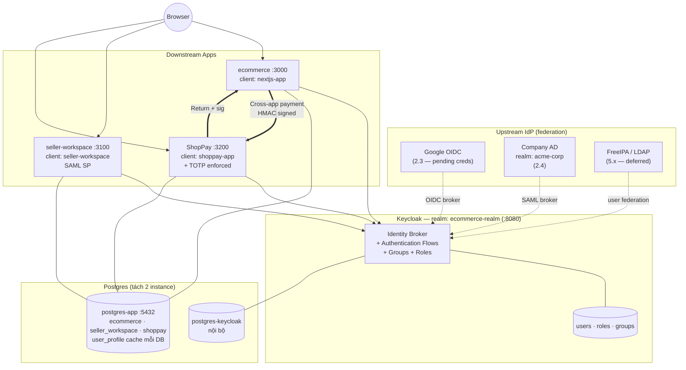

# Ecommerce Platform — Multi-App SSO Demo

Hệ sinh thái 3 app dùng chung 1 Keycloak làm IdP — mô phỏng kiến trúc Shopee / ShopeeFood / ShopeePay.

| App | Port | Vai trò |
|---|---|---|
| [web-app/](web-app) | 3000 | **ecommerce** — chợ cho buyer/seller |
| [seller-workspace/](seller-workspace) | 3100 | **back-office** — chủ shop + nhân viên (kho/CSKH/kế toán) |
| [shoppay/](shoppay) | 3200 | **ví điện tử** — wallet + KYC, **bắt buộc MFA (TOTP)** |

Cả 3 app login chung qua realm `ecommerce-realm`. 1 lần đăng nhập → vào được mọi app (silent SSO).

---

## Kiến trúc



| Stack | Version |
|---|---|
| Next.js | 16 (App Router, Turbopack) |
| NextAuth | 4.24 |
| Keycloak | latest |
| Drizzle ORM | 0.45 |
| PostgreSQL | 15 |
| Node.js | **22 LTS** |

---

## Setup từ 0

Yêu cầu: Docker + Node.js 22 LTS. WSL/Linux/Mac đều OK.

### 1. Clone + tạo `.env` ở root

```bash
git clone <repo> && cd ecommerce-platform
cp .env.example .env

# Sinh secret thật cho mọi biến
node -e "['POSTGRES_PASSWORD','KEYCLOAK_ADMIN_PASSWORD','NEXTJS_APP_CLIENT_SECRET','SELLER_WORKSPACE_CLIENT_SECRET','SHOPPAY_CLIENT_SECRET','BACKEND_ADMIN_CLIENT_SECRET'].forEach(k=>console.log(k+'='+require('crypto').randomBytes(32).toString('hex')))"
# → copy output, paste đè vào .env
```

> File `.env` này là **nguồn duy nhất** của Postgres password, Keycloak admin password, và 4 client secret. Đã có sẵn trong `.gitignore`.

### 2. Tạo `.env` cho 3 app

Mỗi app cần `.env` riêng để Next.js đọc lúc runtime. Giá trị **phải khớp** với root `.env`.

```bash
for d in web-app seller-workspace shoppay; do
  cp $d/.env.example $d/.env
  echo "→ sửa $d/.env: thay CHANGEME-* bằng giá trị tương ứng từ root .env"
done
```

Cụ thể trong từng app `.env`:
- `DATABASE_URL` → password phải = `POSTGRES_PASSWORD` ở root.
- `KEYCLOAK_CLIENT_SECRET` → phải = `<APP>_CLIENT_SECRET` ở root (web-app dùng `NEXTJS_APP_CLIENT_SECRET`).
- `NEXTAUTH_SECRET` → sinh riêng bằng `openssl rand -hex 32` hoặc `node -e ...`.

### 3. Bootstrap hạ tầng + DB + schema

```bash
npm install               # cài concurrently ở root
bash scripts/reset.sh
```

Script này:
- Wipe Postgres volume cũ (nếu có) → up lại Keycloak với secret mới
- Đợi Keycloak ready
- Tạo 3 DB `ecommerce` / `seller_workspace` / `shoppay`
- Push Drizzle schema cho cả 3 app

### 4. Chạy 3 app cùng lúc

```bash
npm run db:push
npm run dev
```

3 app cùng start trong 1 terminal, log có prefix màu `[web]` `[seller]` `[pay]`. `Ctrl+C` 1 lần kill cả 3.

> KHÔNG cần `cd` vào từng `web-app/`, `seller-workspace/`, `shoppay/`. Mọi lệnh đời sống (`dev`, `db:push`) đều chạy ở **root repo**.

> Lần đầu mỗi app sẽ compile chậm (~20–30s do Turbopack). Trong lúc đó browser có thể báo
> `CLIENT_FETCH_ERROR / NetworkError when attempting to fetch resource` — đây là next-auth client
> timeout chờ `/api/auth/session`. Refresh trang sau khi log thấy `Ready` là hết.

---

## Tài khoản

### Keycloak Admin Console — http://localhost:8080

Username/password đọc từ root `.env`:

```bash
grep -E '^KEYCLOAK_ADMIN' .env
```

(Mặc định cũ `admin/admin` đã bỏ — secret giờ là 32-byte random.)

### User demo trong realm `ecommerce-realm`

Password policy: `length(8) and digits(1) and upperCase(1) and lowerCase(1) and specialChars(1)`.

| Username | Password | Role | Dùng cho |
|---|---|---|---|
| `buyer1` | `Buyer1@2024` | buyer | Mua hàng ở ecommerce |
| `seller1` | `Seller1@2024` | seller | Bán hàng + vào seller-workspace |
| `admin1` | `Admin1@2024` | admin | Duyệt seller request |
| `warehouse1` | `Warehouse1@2024` | staff-warehouse | Nhân viên kho (group `/store-demo-1/warehouse`) |
| `cs1` | `Cs1@2024` | staff-cs | Nhân viên CSKH |
| `finance1` | `Finance1@2024` | staff-finance | Nhân viên tài chính |
| `wallet1` | `Wallet1@2024` | wallet-user | **Bắt buộc setup TOTP** ở login đầu |

---

## Test theo kịch bản

> Mở 1 trình duyệt **incognito riêng cho mỗi kịch bản** (hoặc clear cookie giữa các lần) — vì SSO nhớ session, dễ "ngỡ là OK" do phiên cũ.

### Kịch bản A — Smoke test (5 phút, làm trước tiên)

Mục tiêu: chắc chắn 3 app + Keycloak alive, secret khớp đúng.

1. **Health check**:
   ```bash
   curl -s http://localhost:8080/realms/ecommerce-realm/.well-known/openid-configuration | head -c 80
   curl -sI http://localhost:3000  # 200 hoặc 307 đều OK
   curl -sI http://localhost:3100
   curl -sI http://localhost:3200
   ```
2. Mở incognito → http://localhost:3000 → click "Đăng nhập" → Keycloak hỏi tài khoản → nhập `buyer1` / `Buyer1@2024` → quay về :3000 với header chào tên user.
3. Logout → kết thúc.

❌ Nếu thấy `invalid_client` → secret trong `web-app/.env` không khớp `NEXTJS_APP_CLIENT_SECRET` ở root `.env`. Sửa rồi `npm run dev` lại.

### Kịch bản B — Silent SSO cross-app

Mục tiêu: chứng minh 1 lần login dùng cho cả 3 app.

1. Trong incognito, login `seller1` ở http://localhost:3000.
2. Mở **tab mới cùng cửa sổ** → http://localhost:3100 → click "Đăng nhập SSO".
3. **Kỳ vọng**: redirect Keycloak rồi quay về luôn — KHÔNG hỏi password.

Verify trong DevTools → Network: request `…/auth/realms/ecommerce-realm/protocol/openid-connect/auth?...` trả `302` thẳng về `/api/auth/callback/keycloak`, không qua trang login.

### Kịch bản C — Phân quyền nhân viên (Keycloak Groups)

Mục tiêu: cùng 1 store, 3 nhân viên có 3 quyền khác nhau.

1. Login `warehouse1` ở :3100 → vào `/dashboard`. Page hiển thị `roles: ["staff-warehouse"]` và `groups: ["/store-demo-1/warehouse"]`.
2. Logout → login `cs1` → role/group khác.
3. Logout → login `finance1` → role/group khác.

→ Cùng group cha `store-demo-1`, sub-group quyết định quyền.

### Kịch bản D — Server actions + audit log

Mục tiêu: action có authZ check + ghi audit.

1. Login `seller1` ở :3100 (vì action `staff.invite` yêu cầu role `seller` hoặc `admin`).
2. Vào `/staff` → nhập email + role staff → submit.
3. Vào `/audit` → thấy entry mới với `action: "staff.invite"`, `actorId`, `metadata`.
4. Logout, login `warehouse1` → vào `/staff` → thử mời → bị reject (action guard chặn ở server).

### Kịch bản E — MFA bắt buộc cho ShopPay

Mục tiêu: cùng 1 user pool nhưng app `shoppay-app` có policy bảo mật khác.

1. Login `wallet1` / `Wallet1@2024` ở http://localhost:3200.
2. Keycloak detect required action `CONFIGURE_TOTP` → bắt setup.
3. Cài Google Authenticator / 1Password / Authy → quét QR.
4. Nhập 6 chữ số → confirm → redirect về :3200.
5. Logout, login lại → bị hỏi TOTP code mỗi lần (không chỉ lần đầu).
6. Login cùng `wallet1` ở :3000 (nếu wallet1 có role buyer) → vẫn cần TOTP do realm-level credential.

> Nếu muốn skip TOTP cho `wallet1` lúc dev: vào Keycloak Admin → Users → wallet1 → Required user actions → xoá `Configure OTP`.

### Kịch bản F — Topup ví + KYC gating

Mục tiêu: action guard 2 layer (route guard + business rule).

1. Login `wallet1` ở :3200 (sau khi xong TOTP ở E).
2. Vào `/topup` → nạp 1.000.000 → OK, balance tăng.
3. Topup 6.000.000 → fail với message "cần `kyc-verified`".
4. Vào `/kyc` → submit giấy tờ (mock) → admin approve qua Keycloak Admin → assign role `kyc-verified` cho user → logout/login → topup 6.000.000 OK.

### Kịch bản G — Logout + hết session

1. Login đủ 3 app.
2. Logout ở :3000.
3. Reload :3100 và :3200 → khi token cũ hết hạn (default 5 phút), Keycloak phát hiện session đã chết → app redirect signin.

> Back-channel logout chính thống (single logout đồng bộ ngay) cần thêm config — xem [todo.md](todo.md).

---

## Reset nhanh

Khi sửa `keycloak/ecommerce-realm.json`, đổi user/role/client → cần wipe + import lại:

```bash
bash scripts/reset.sh
```

Script tự backup `pg_dumpall` ra `backup-YYYYMMDD-HHMM.sql` trước khi wipe.

---

## Cấu trúc

```
ecommerce-platform/
├── .env / .env.example         # Secret root (Postgres + Keycloak admin + client secrets)
├── package.json                # Root: concurrently runner cho 3 app
├── docker-compose.yml          # Postgres + Keycloak + Nginx
├── scripts/reset.sh            # Wipe + reimport realm + tạo DB + push schema
│
├── keycloak/
│   ├── ecommerce-realm.json    # Realm + clients + roles + groups + users (secret = ${VAR})
│   └── entrypoint.sh           # Resolve ${VAR} từ env vào realm.json trước khi Keycloak start
├── nginx/nginx.conf
│
├── web-app/                    # ecommerce (3000)
│   ├── app/                    # buyer/seller/admin pages + API
│   ├── db/schema.ts            # stores, products, orders, cart, seller_upgrade_requests
│   ├── lib/keycloak-admin.ts   # Keycloak Admin API client
│   └── proxy.ts                # NextAuth middleware
│
├── seller-workspace/           # back-office (3100)
│   ├── app/dashboard, /staff, /audit
│   ├── db/schema.ts            # staff_invitations, store_permissions, audit_logs
│   └── lib/audit.ts
│
└── shoppay/                    # ví (3200)
    ├── app/wallet, /topup, /kyc
    ├── db/schema.ts            # wallets, transactions, kyc_documents
    └── lib/wallet.ts           # topUp / pay (transactional)
```

---

## Troubleshooting

**`invalid_client` khi login** → Secret trong app `.env` không khớp giá trị Keycloak đang giữ. Verify:
```bash
grep CLIENT_SECRET .env web-app/.env seller-workspace/.env shoppay/.env
```

**`/dashboard` redirect lặp về signin** → Cookie name custom phải khớp giữa `app/api/auth/[...nextauth]/route.ts` và `proxy.ts` của app đó.

**`relation "products" does not exist`** → Chưa push schema. `bash scripts/reset.sh` hoặc `npm run db:push`.

**`CLIENT_FETCH_ERROR / NetworkError when attempting to fetch resource`** → next-auth client timeout chờ `/api/auth/session` lúc Turbopack compile lần đầu (xem log thấy session 200 sau 13–20s). Refresh trang khi đã `Ready` là hết. Nếu kéo dài, kiểm tra `NEXTAUTH_URL` trong app `.env` có đúng port không.

**Buyer login :3100 bị redirect `/?denied=role`** → Đúng intent. `seller-workspace/proxy.ts` chỉ cho `seller / admin / staff-*` vào `/dashboard`, `/staff`, `/audit`. Để test :3100, dùng `seller1` hoặc `warehouse1` / `cs1` / `finance1`.

**`permission denied … docker.sock`** → User WSL chưa thuộc group docker:
```bash
sudo usermod -aG docker $USER && exit   # mở lại WSL tab
```

**`CREATE DATABASE cannot run inside a transaction block`** → Mỗi DB tách 1 cờ `-c` riêng trong `psql`.

**Next dev exit silently sau "Ready"** → Đang dùng Node 25/odd. Đổi Node 22 LTS:
```bash
nvm install 22 && nvm use 22 && rm -rf node_modules && npm install
```

**`WSL 1 is not supported`** khi chạy node trong WSL → đang gọi Windows node.exe. Cài node trong WSL hoặc chạy từ PowerShell.

**`Can't resolve 'tailwindcss'`** → 3 `next.config.ts` phải có `turbopack: { root: import.meta.dirname }` để pin root vào app dir, không dùng monorepo root.

**`npm audit fix --force` đã chạy lỡ tay** → Lệnh đó downgrade `next-auth` về v3, vỡ tất cả import. Restore:
```json
"next-auth": "^4.24.13",
"drizzle-kit": "^0.31.10"
```
Rồi `rm -rf node_modules package-lock.json && npm install`.

---

## Lộ trình mở rộng

Xem [todo.md](todo.md) và [PLAN.md](PLAN.md). Còn lại:

- [ ] **SAML 2.0 Identity Brokering** — nhân viên seller login bằng IdP công ty (Azure AD / Okta).
- [ ] **Google Identity Brokering** cho buyer.
- [ ] Cross-app payment flow: `ecommerce checkout → shoppay /pay → ecommerce return`.
- [ ] **Back-channel logout** — Single Logout chuẩn.
- [ ] **Keycloak Event Listener SPI** — đồng bộ user create/update/delete sang `user_profile` cache.
- [ ] **FreeIPA / Samba AD-DC + LDAP federation** — domain control cho thiết bị.
- [ ] App **ShopFood** (multi-tenant restaurant marketplace).
- [ ] Step-up auth ShopPay: re-prompt TOTP cho từng giao dịch lớn.
