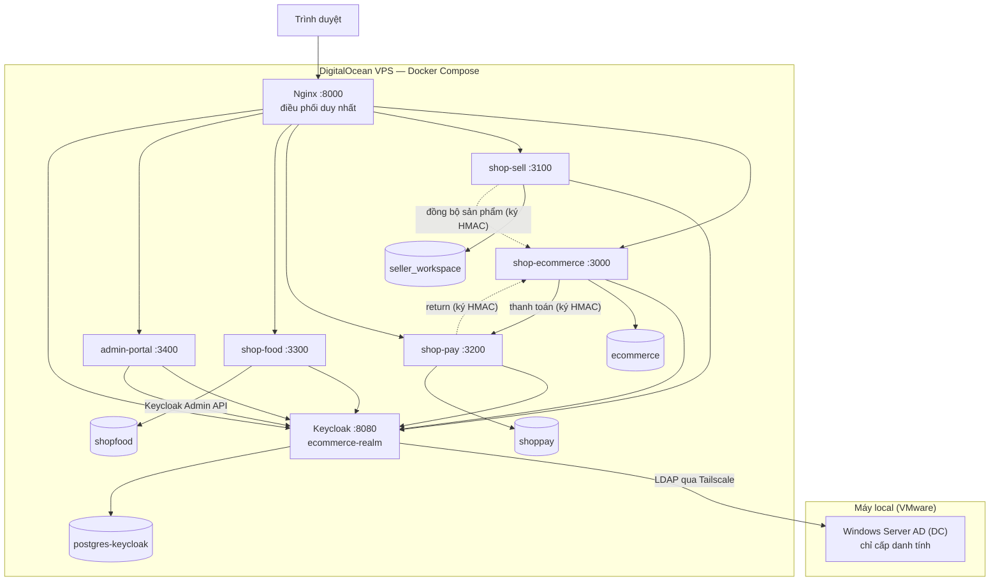

# Ecommerce Platform - Multi-App SSO

Hệ sinh thái thương mại điện tử đa ứng dụng, dùng chung Keycloak làm Identity Provider trung tâm cho SSO, MFA, phân quyền theo role và Single Logout. Danh tính khách hàng do Keycloak/PostgreSQL quản lý; danh tính nhân sự nền tảng (admin) do Windows Server Active Directory cấp qua LDAP federation.

5 ứng dụng, tất cả đã triển khai. Hạ tầng AD/LDAP, VPS và Kerberos còn lại trong [PLAN.md](PLAN.md) (Phase 4-6).

| App (sản phẩm) | Thư mục | Port | OIDC client | DB | Trạng thái |
| --- | --- | --- | --- | --- | --- |
| ShopEcommerce | `shop-ecommerce` | 3000 | `nextjs-app` | `ecommerce` | Done |
| ShopSell | `shop-sell` | 3100 | `seller-workspace` | `seller_workspace` | Done (catalog sync + quản lý đơn) |
| ShopPay | `shop-pay` | 3200 | `shoppay-app` | `shoppay` | Done |
| ShopFood | `shop-food` | 3300 | `shopfood-app` | `shopfood` | Done (SSO/SLO + đặt món) |
| Admin Portal | `admin-portal` | 3400 | `admin-portal` | `admin_portal` (audit/cache) | Done (quản trị tập trung + user/role + KYC) |

Hạ tầng:

| Thành phần | Vai trò |
| --- | --- |
| Keycloak (:8080) | OIDC IdP, LDAP federation tới AD, role/MFA/SLO |
| Nginx (:8000) | Reverse proxy / điều phối duy nhất của hệ thống |
| Postgres app (:5432) | DB cho các app (ecommerce, seller_workspace, shoppay, shopfood, admin_portal) |
| Postgres keycloak | DB riêng cho Keycloak (nội bộ) |
| Windows Server AD | Domain Controller — chỉ cấp danh tính cho nhân sự nền tảng (external, qua Tailscale) |

> **Đặt tên:** thư mục theo tên sản phẩm (`shop-ecommerce`, `shop-sell`, `shop-pay`, `shop-food`, `admin-portal`). Định danh nội bộ giữ tên cũ (OIDC client `nextjs-app`/`seller-workspace`/`shoppay-app`, tên DB, cookie session) để không phá realm import và secret sync.

## Mô hình danh tính

Hệ thống có hai nhóm người dùng, hai nguồn danh tính, hợp nhất trong realm `ecommerce-realm`:

- **Khách hàng, người bán, nhân viên shop** (`buyer`, `seller`, `staff`, `food-seller`, `wallet-user`, `kyc-verified`): lưu trong Keycloak (PostgreSQL). Tự đăng ký / đăng nhập trực tiếp.
- **Nhân sự nền tảng** (`admin`, `ecommerce_admin`, `food_admin`, `pay_admin`): KHÔNG lưu trong Keycloak. Được cấp trong **Windows Server Active Directory** và đưa vào Keycloak qua **LDAP user federation**. Nhóm (group) trong AD map sang role admin tương ứng.

Hệ quả thiết kế:

- Domain Controller chỉ đóng một vai trò: cung cấp định danh. Không chứa logic ứng dụng, không cấp phát quyền ngoài việc quyết định user thuộc nhóm nào.
- Xoá một tài khoản khỏi AD => Keycloak không còn federate được user đó => tài khoản mất quyền truy cập toàn bộ hệ sinh thái (xem PLAN.md mục deprovisioning về TTL token).
- Giai đoạn đầu dùng LDAP (nhập tài khoản AD trên trang login Keycloak). Kerberos/SPNEGO "tự nhận diện từ máy domain-joined" là giai đoạn sau.

## Vai trò (roles)

Các role phía khách hàng/người bán là **composite role** (gán role cha tự kéo theo role con), nên một lần gán là đủ cả chuỗi:

- `buyer`: mặc định — mua sắm (ShopEcommerce), đặt món (ShopFood). Là role nền của mọi tài khoản phía khách.
- `staff` (⊇ `buyer`): nhân viên shop, **gắn với đúng 1 shop** qua Keycloak group (`/store-demo-*`, mang attribute `storeId`).
- `seller` (⊇ `staff` → `buyer`): chủ shop ShopSell. Mặc định đã bao gồm quyền `staff`. Xin từ `buyer`.
- `food-seller` (⊇ `buyer`): chủ nhà hàng ShopFood. Đứng riêng (ShopFood không có `staff`). Xin từ `buyer`.
- `wallet-user` (⊇ `buyer`): bắt buộc để dùng ShopPay. Chỉ `buyer` mới xin được.
- `kyc-verified` (⊇ `wallet-user` → `buyer`): cấp sau khi duyệt KYC, mở giao dịch giá trị cao.
- `admin`: toàn quyền nền tảng (từ AD).
- `ecommerce_admin`: quản trị mảng Ecommerce hợp nhất (ShopEcommerce + ShopSell), gồm gian hàng, sản phẩm, đơn hàng và tài khoản buyer/seller/staff.
- `food_admin`: quản trị ShopFood, gồm nhà hàng/food-seller, thực đơn, đơn món và tài khoản Food.
- `pay_admin`: quản trị ShopPay + quyền duyệt KYC.

## Kiến trúc triển khai



Toàn bộ app, Keycloak, Postgres, Nginx chạy trên một VPS DigitalOcean qua Docker Compose. Windows Server AD chạy ở máy local; VPS và máy local nối nhau qua Tailscale, Keycloak federate LDAP tới AD qua đường Tailscale.

## Tech stack

- Frontend: React 19, Next.js, TypeScript, NextAuth v4.
- Identity: Keycloak (OIDC, LDAP federation), Windows Server Active Directory.
- Database: PostgreSQL, Drizzle ORM.
- Bảo mật: HMAC-SHA256 (cross-app), TOTP (ShopPay MFA), (ES256 dự kiến).
- Hạ tầng: Docker Compose, Nginx, Tailscale, DigitalOcean VPS, Bash scripts.
- Runtime: Node.js 22 LTS.

## Yêu cầu

- Docker và Docker Compose.
- Node.js 22 LTS.
- Bash shell (WSL/Linux/Mac).
- (Tùy chọn, cho phần AD) Windows Server với AD DS + Tailscale.

## Chạy local

```bash
git clone <repo>
cd ecommerce-platform

bash scripts/bootstrap.sh
bash scripts/reset.sh
npm install
npm run dev
```

Sau khi chạy:

- ShopEcommerce: http://localhost:3000
- ShopSell: http://localhost:3100
- ShopPay: http://localhost:3200
- ShopFood: http://localhost:3300
- Admin Portal: http://localhost:3400
- Keycloak: http://localhost:8080

Cả 5 app đã nằm trong `npm run dev`. Admin Portal (:3400) đăng nhập bằng tài khoản có role admin nền tảng (vd `admin1`). Thực đơn mẫu ShopFood: `npm --prefix shop-food run db:seed`.

Lưu ý:

- Lần đầu Turbopack compile route có thể chậm; đợi log `[warm] done`.
- Khi sửa realm JSON, chạy lại `bash scripts/reset.sh` để reimport.
- Không commit root `.env`.

### Cấu hình AD/LDAP (nhân sự nền tảng) — chạy LOCAL

Đưa danh tính admin/*_admin từ **Windows Server AD (VMware trên máy local)** vào Keycloak qua LDAP user federation. **Chưa cần VPS/Tailscale** ở giai đoạn này. Hướng dẫn từng bước (mạng VMware Bridged, tạo OU/group/user, service account bind, User Federation, group→role mapper, test, deprovisioning): **[docs/active-directory.md](docs/active-directory.md)**. Khi chưa dựng AD, các role admin vẫn test được bằng user Keycloak-local (`admin1`).

## Tài khoản demo (Keycloak-local)

| Username | Password | Role (effective) | Group / Shop | Dùng cho |
| --- | --- | --- | --- | --- |
| `buyer1` | `Buyer1@2024` | `buyer` | - | Mua hàng, đặt món |
| `buyer2` | `Buyer2@2024` | `buyer` | - | Buyer demo bổ sung |
| `buyer3` | `Buyer3@2024` | `buyer` | - | Buyer demo bổ sung |
| `seller1` | `Seller1@2024` | `seller` → `staff` → `buyer` | `/store-demo-1` (chủ) | ShopSell |
| `staff1` | `Staff1@2024` | `staff` → `buyer` | `/store-demo-1` | Nhân viên shop 1 |
| `seller2` | `Seller2@2024` | `seller` → `staff` → `buyer` | `/store-demo-2` (chủ) | ShopSell (shop 2) |
| `staff2` | `Staff2@2024` | `staff` → `buyer` | `/store-demo-2` | Nhân viên shop 2 |
| `food-seller1` | `Foodseller1@2024` | `food-seller` → `buyer` | - | Chủ nhà hàng ShopFood |
| `wallet1` | `Wallet1@2024` | `wallet-user` → `buyer` | - | ShopPay (cần TOTP) |
| `kyc1` | `Kyc1@2024` | `kyc-verified` → `wallet-user` → `buyer` | - | ShopPay đã KYC (giao dịch >5tr) |
| `admin1` | `Admin1@2024` | `admin` | - | Admin/KYC review (tạm; production lấy từ AD) |

> `admin1` là user Keycloak-local để demo khi chưa wire AD. Khi bật LDAP federation, danh tính admin thật đến từ Active Directory.

## Test plan

Chạy mỗi kịch bản trong incognito mới để tránh session cũ.

- **A. Smoke**: `curl` issuer Keycloak + 5 app trả 200/redirect hợp lệ.
- **B. SSO cross-app**: login `seller1` ở :3000, mở :3100 không phải nhập lại pass.
- **C. ShopSell role guard**: `buyer1` vào :3100 bị đẩy `/denied`.
- **D. ShopPay TOTP**: login ví yêu cầu OTP theo flow `browser-shoppay`.
- **E. KYC + topup > 5tr**: nộp KYC, admin approve, logout/login lấy token mới có `kyc-verified`, topup thành công.
- **F. Cross-app HMAC**: sửa `amount`/`orderId` trên URL thanh toán => ShopPay reject chữ ký sai.
- **G. Single Logout**: logout 1 app => 2 app còn lại mất session sau reload.

## Cấu trúc repo

```text
ecommerce-platform/
├── docker-compose.yml
├── package.json
├── scripts/
│   ├── bootstrap.sh
│   ├── reset.sh
│   ├── warmup.sh
│   └── init-app-dbs.sql
├── keycloak/
│   ├── ecommerce-realm.json
│   └── entrypoint.sh
├── nginx/
├── shop-ecommerce/     # ShopEcommerce :3000  (Done)
├── shop-sell/          # ShopSell :3100       (Done)
├── shop-pay/           # ShopPay :3200        (Done)
├── shop-food/          # ShopFood :3300       (Done)
└── admin-portal/       # Admin Portal :3400   (Done)
```

## Troubleshooting

- `invalid_client`: secret app `.env` không khớp realm => `bash scripts/bootstrap.sh && bash scripts/reset.sh`.
- `unresolved placeholder` khi import realm: thiếu secret trong root `.env` hoặc thiếu biến trong `keycloak/entrypoint.sh` `VARS_TO_RESOLVE`.
- ShopPay vẫn báo cần KYC sau approve: kiểm tra `kyc_documents.status=approved`, role `kyc-verified` trên Keycloak, restart dev server.
- `Session not active`: Keycloak đã revoke session; refresh fail bị coi như logged-out, proxy redirect signin.

## Tài liệu liên quan

- [PLAN.md](PLAN.md): kế hoạch xây dựng chi tiết theo phase.
- [TODO.md](TODO.md): checklist nhiệm vụ.
- [docs/keycloak.md](docs/keycloak.md): truy cập Admin Console, xem nội dung realm, cơ chế lưu/tái lập cấu hình.
- [docs/phase-1-catalog-sync.md](docs/phase-1-catalog-sync.md): Phase 1 — đồng bộ catalog ShopSell → ShopEcommerce + cách kiểm thử.
